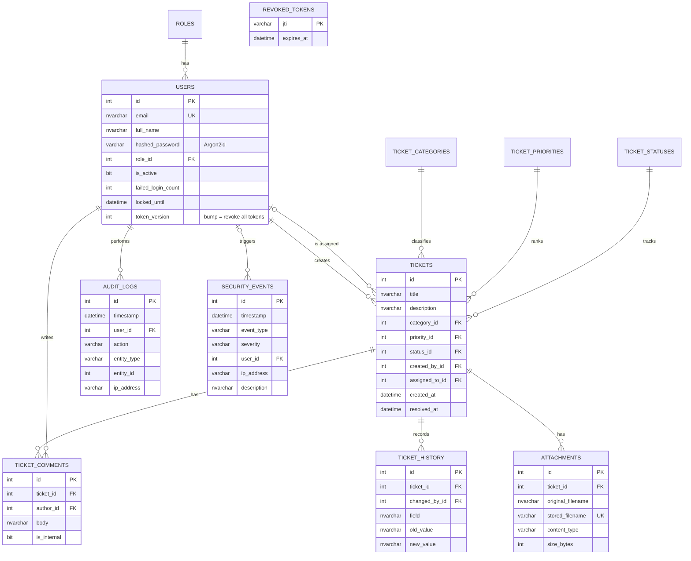
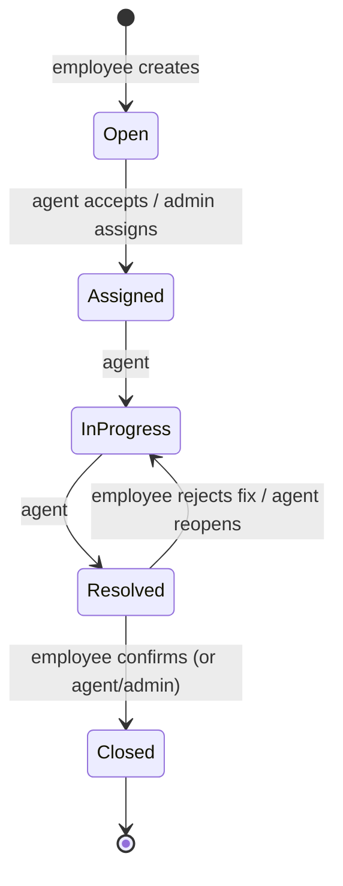

# Database design

```mermaid
erDiagram
    ROLES ||--o{ USERS : "has"
    USERS ||--o{ TICKETS : "creates"
    USERS |o--o{ TICKETS : "is assigned"
    TICKET_CATEGORIES ||--o{ TICKETS : "classifies"
    TICKET_PRIORITIES ||--o{ TICKETS : "ranks"
    TICKET_STATUSES ||--o{ TICKETS : "tracks"
    TICKETS ||--o{ TICKET_COMMENTS : "has"
    TICKETS ||--o{ TICKET_HISTORY : "records"
    TICKETS ||--o{ ATTACHMENTS : "has"
    USERS ||--o{ TICKET_COMMENTS : "writes"
    USERS ||--o{ AUDIT_LOGS : "performs"
    USERS |o--o{ SECURITY_EVENTS : "triggers"

    USERS {
        int id PK
        nvarchar email UK
        nvarchar full_name
        varchar hashed_password "Argon2id"
        int role_id FK
        bit is_active
        int failed_login_count
        datetime locked_until
        int token_version "bump = revoke all tokens"
    }
    TICKETS {
        int id PK
        nvarchar title
        nvarchar description
        int category_id FK
        int priority_id FK
        int status_id FK
        int created_by_id FK
        int assigned_to_id FK
        datetime created_at
        datetime resolved_at
    }
    TICKET_COMMENTS { int id PK  int ticket_id FK  int author_id FK  nvarchar body  bit is_internal }
    TICKET_HISTORY  { int id PK  int ticket_id FK  int changed_by_id FK  nvarchar field  nvarchar old_value  nvarchar new_value }
    ATTACHMENTS     { int id PK  int ticket_id FK  nvarchar original_filename  varchar stored_filename UK  varchar content_type  int size_bytes }
    AUDIT_LOGS      { int id PK  datetime timestamp  int user_id FK  varchar action  varchar entity_type  int entity_id  varchar ip_address }
    SECURITY_EVENTS { int id PK  datetime timestamp  varchar event_type  varchar severity  int user_id FK  varchar ip_address  nvarchar description }
    REVOKED_TOKENS  { varchar jti PK  datetime expires_at }
```

## Ticket workflow

```mermaid
stateDiagram-v2
    [*] --> Open: employee creates
    Open --> Assigned: agent accepts / admin assigns
    Assigned --> InProgress: agent
    InProgress --> Resolved: agent
    Resolved --> Closed: employee confirms (or agent/admin)
    Resolved --> InProgress: employee rejects fix / agent reopens
    Closed --> [*]
```
